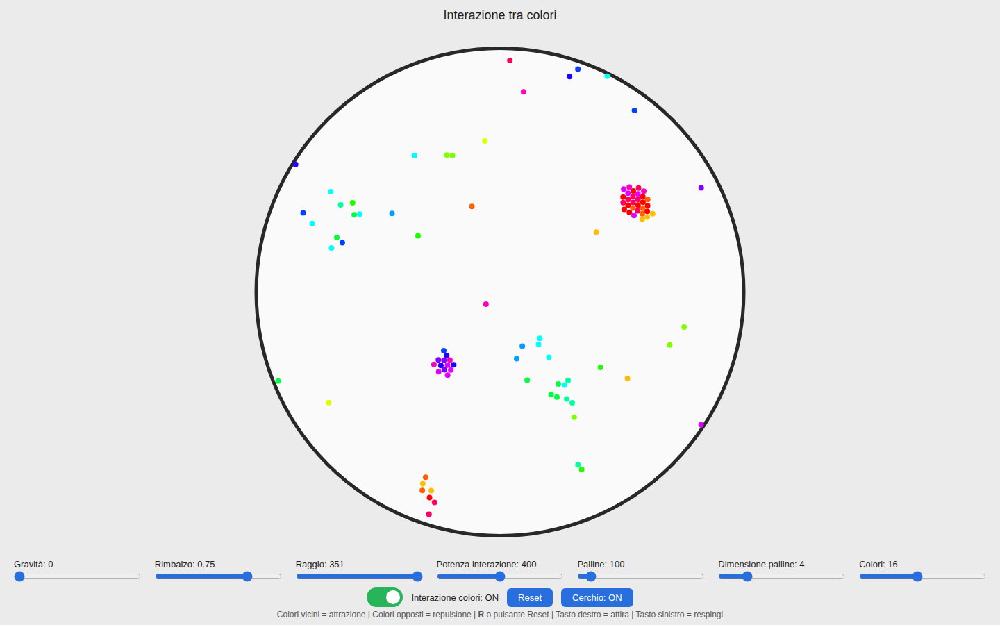
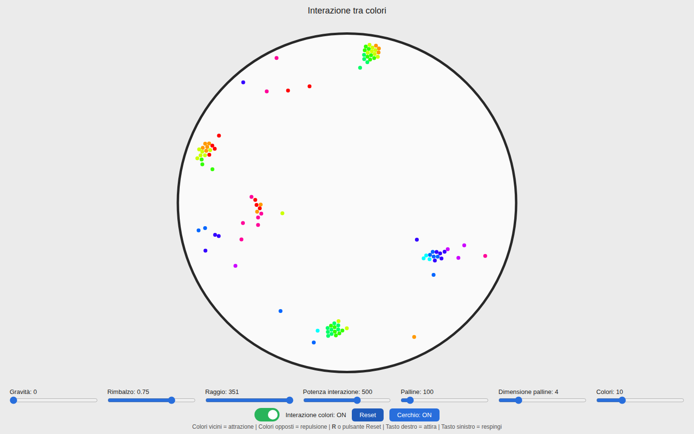
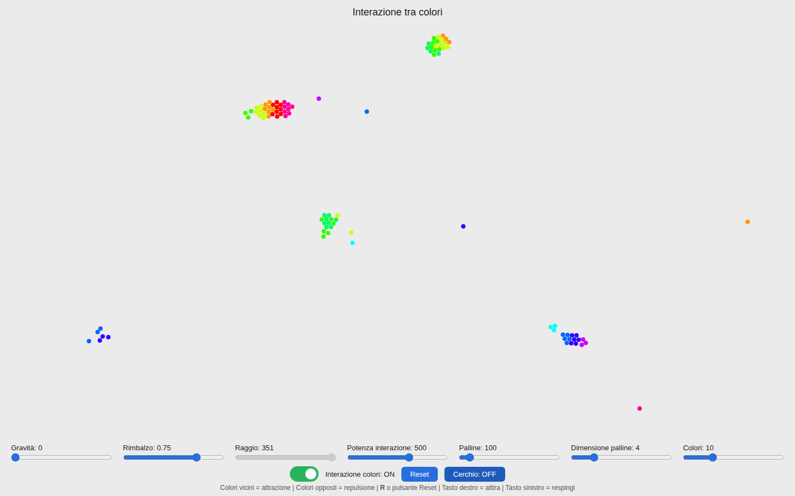
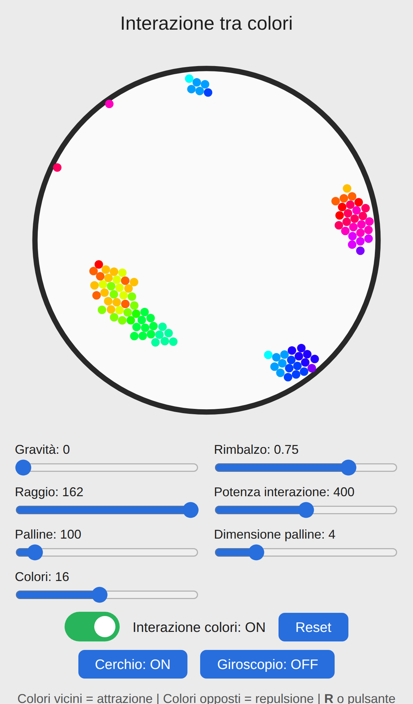

# Interazione tra colori / Color Interaction

🇮🇹 [Italiano](#-italiano) · 🇬🇧 [English](#-english)

**Demo:** https://lele-sick.github.io/color-balls/

|  |  |
| --- | --- |
|  |  |
|  |  |

---

## 🇮🇹 Italiano

Una simulazione fisica in tempo reale, scritta in JavaScript puro (nessuna dipendenza). Centinaia di palline colorate rimbalzano dentro un cerchio, e ogni pallina è **attratta dai colori vicini** sulla ruota cromatica e **respinta da quelli opposti**.

### Caratteristiche

- Fino a **1300 palline**, con collisioni, gravità e rimbalzo regolabili
- Da **1 a 34 colori**, equidistanti sulla ruota cromatica
- Interazione tra colori: colori simili si attraggono, colori opposti si respingono
- **Mouse:** tieni premuto il tasto destro per attirare tutte le palline, il sinistro per respingerle
- **Rotella del mouse** sugli slider per cambiare i valori
- Cerchio attivabile/disattivabile: senza cerchio le palline rimbalzano contro i bordi dell'area
- **Giroscopio** (solo mobile): la gravità segue l'inclinazione del telefono
- Fisica stabile: sotto-passi, griglia spaziale per le collisioni, nessun rimbalzo per urti molto lenti

### Controlli

| Controllo | Intervallo | Cosa fa |
| --- | --- | --- |
| Gravità | 0 – 150 | Intensità della gravità (default 0) |
| Rimbalzo | 0 – 1 | Elasticità degli urti |
| Raggio | 120 – max | Raggio del cerchio (max = spazio disponibile) |
| Potenza interazione | 0 – 800 (step 5) | Forza di attrazione/repulsione tra colori |
| Palline | 10 – 1300 (step 10) | Numero di palline (ricrea la simulazione) |
| Dimensione palline | 2 – 12 | Raggio delle palline |
| Colori | 1 – 34 | Quanti colori diversi compaiono |
| Interazione colori | ON / OFF | Attiva o disattiva le forze tra colori |
| Reset | pulsante o tasto `R` | Ricrea le palline |
| Cerchio | ON / OFF | Mostra o toglie il cerchio contenitore |
| Giroscopio | ON / OFF | Gravità dal sensore del telefono (solo mobile) |

**Mouse:** tasto destro = attira · tasto sinistro = respinge · rotella sugli slider = cambia il valore.
Questi controlli funzionano solo con il mouse, non con il tocco.

### Come avviarlo

Apri `index.html` nel browser, oppure servi la cartella:

```bash
python3 -m http.server 8000
# poi apri http://localhost:8000
```

### Pubblicarlo su GitHub Pages

È un sito statico. Su GitHub: **Settings → Pages → Deploy from a branch → `main` / `(root)`**.
Il sito sarà servito in HTTPS.

### Giroscopio: serve HTTPS

I browser mobili danno i dati del sensore solo alle pagine in **HTTPS** (o `localhost`). Con `http://` semplice il pulsante Giroscopio non funziona. Su iOS il browser chiede inoltre il permesso al primo tocco.

### Come funziona

- Ogni pallina ha un colore (tonalità da 0 a 1 sulla ruota cromatica).
- La distanza tra due colori va da 0 (uguali) a 0,5 (opposti). Sotto 0,25 le palline si attraggono (più forte se il colore è più simile), sopra 0,25 si respingono.
- La forza cala linearmente con la distanza fino a 180 px.
- La fisica usa sotto-passi adattivi e una griglia spaziale per trovare le palline vicine, così resta fluida anche con molte palline.

### Struttura del progetto

```
index.html          pagina e controlli
style.css           stile e layout
simulation.js       fisica, disegno, input
```

### Parametri modificabili in `simulation.js`

| Costante | Significato |
| --- | --- |
| `INTERACTION_DISTANCE` | Distanza massima delle forze tra colori (px) |
| `MAX_SPEED` | Velocità massima (px/s) |
| `MIN_SUBSTEPS` / `MAX_SUBSTEPS` | Sotto-passi di fisica per frame |
| `COLLISION_ITERATIONS` | Ripetizioni della risoluzione delle collisioni |
| `REST_THRESHOLD` | Sotto questa velocità l'urto non rimbalza |
| `POINTER_FORCE` | Forza di attrazione/repulsione del mouse |
| `WHEEL_NOTCHES` | Scatti di rotella per percorrere un intero slider |

### Licenza

Questo progetto è distribuito con licenza **MIT**: puoi usarlo, modificarlo e ridistribuirlo liberamente, anche per scopi commerciali, citando l'autore originale. Vedi il file [`LICENSE`](./LICENSE).

---

## 🇬🇧 English

A real-time physics simulation written in plain JavaScript (no dependencies). Hundreds of colored balls bounce inside a circle, and each ball is **attracted to nearby colors** on the color wheel and **repelled by opposite ones**.

### Features

- Up to **1300 balls**, with adjustable collisions, gravity and bounce
- **1 to 34 colors**, evenly spaced on the color wheel
- Color interaction: similar colors attract, opposite colors repel
- **Mouse:** hold the right button to attract all balls, the left button to repel them
- **Mouse wheel** over the sliders changes their values
- Circle can be toggled: without it the balls bounce off the edges of the play area
- **Gyroscope** (mobile only): gravity follows the tilt of the phone
- Stable physics: sub-stepping, spatial grid for collisions, no bounce on very slow impacts

### Controls

| Control | Range | What it does |
| --- | --- | --- |
| Gravity (*Gravità*) | 0 – 150 | Gravity strength (default 0) |
| Bounce (*Rimbalzo*) | 0 – 1 | Elasticity of impacts |
| Radius (*Raggio*) | 120 – max | Circle radius (max = available space) |
| Interaction strength (*Potenza interazione*) | 0 – 800 (step 5) | Attraction/repulsion force between colors |
| Balls (*Palline*) | 10 – 1300 (step 10) | Number of balls (recreates the simulation) |
| Ball size (*Dimensione palline*) | 2 – 12 | Ball radius |
| Colors (*Colori*) | 1 – 34 | How many different colors appear |
| Color interaction (*Interazione colori*) | ON / OFF | Turns color forces on or off |
| Reset | button or `R` key | Recreates the balls |
| Circle (*Cerchio*) | ON / OFF | Shows or removes the container circle |
| Gyroscope (*Giroscopio*) | ON / OFF | Gravity from the phone sensor (mobile only) |

**Mouse:** right button = attract · left button = repel · wheel over sliders = change value.
These controls work with a mouse only, not with touch.

### Running it

Open `index.html` in a browser, or serve the folder:

```bash
python3 -m http.server 8000
# then open http://localhost:8000
```

### Publishing on GitHub Pages

It is a static site. On GitHub: **Settings → Pages → Deploy from a branch → `main` / `(root)`**.
The site will be served over HTTPS.

### Gyroscope: HTTPS required

Mobile browsers only provide sensor data to **HTTPS** pages (or `localhost`). With plain `http://` the Gyroscope button will not work. On iOS the browser also asks for permission on the first tap.

### How it works

- Each ball has a color (a hue from 0 to 1 on the color wheel).
- The distance between two colors goes from 0 (same) to 0.5 (opposite). Below 0.25 the balls attract (more strongly the closer the colors), above 0.25 they repel.
- The force decreases linearly with distance, up to 180 px.
- The physics uses adaptive sub-steps and a spatial grid to find nearby balls, so it stays smooth even with many balls.

### Project structure

```
index.html          page and controls
style.css           styles and layout
simulation.js       physics, rendering, input
```

### Tunable parameters in `simulation.js`

| Constant | Meaning |
| --- | --- |
| `INTERACTION_DISTANCE` | Maximum range of color forces (px) |
| `MAX_SPEED` | Maximum speed (px/s) |
| `MIN_SUBSTEPS` / `MAX_SUBSTEPS` | Physics sub-steps per frame |
| `COLLISION_ITERATIONS` | Repeats of the collision solver |
| `REST_THRESHOLD` | Below this speed an impact does not bounce |
| `POINTER_FORCE` | Mouse attraction/repulsion strength |
| `WHEEL_NOTCHES` | Wheel notches needed to cross a whole slider |

### License

This project is released under the **MIT license**: you are free to use, modify and redistribute it, including for commercial purposes, as long as you credit the original author. See the [`LICENSE`](./LICENSE) file.
